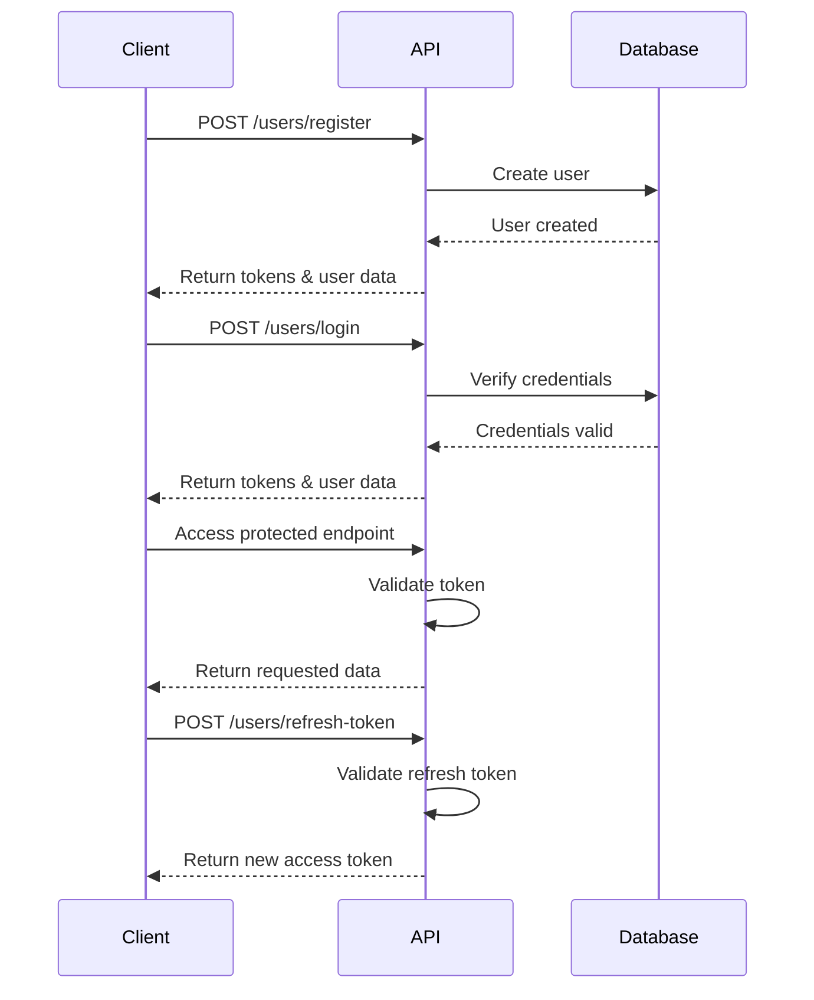
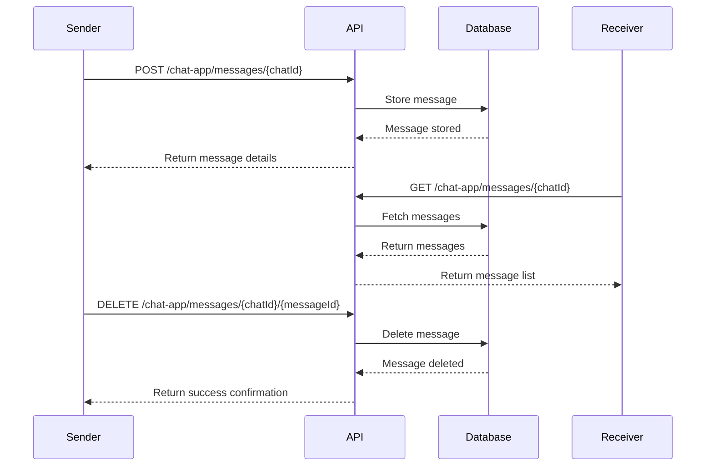

# Chat Application API Documentation

## Overview

This document provides comprehensive information about the Chat Application API endpoints, authentication methods, and data structures.

## Base URL

```
https://api.freeapi.app/api/v1
```

## API Flow Diagrams

### Authentication Flow



### Messaging Flow



## Authentication

The API uses JWT (JSON Web Token) authentication with access tokens and refresh tokens.

### Headers

| Header        | Value                  | Description                |
| ------------- | ---------------------- | -------------------------- |
| Content-Type  | `application/json`     | For most requests          |
| Content-Type  | `multipart/form-data`  | For file uploads           |
| Authorization | `Bearer {accessToken}` | For authenticated requests |

## User Authentication Endpoints

### Register User

| Detail         | Value                      |
| -------------- | -------------------------- |
| URL            | `/users/register`          |
| Method         | `POST`                     |
| Description    | Creates a new user account |
| Authentication | Not required               |

**Request Body:**

```json
{
  "email": "user@example.com",
  "password": "securepassword",
  "username": "username",
  "role": "USER"
}
```

**Response:** Returns user data and authentication tokens

### Login

| Detail         | Value                                           |
| -------------- | ----------------------------------------------- |
| URL            | `/users/login`                                  |
| Method         | `POST`                                          |
| Description    | Authenticates a user and provides access tokens |
| Authentication | Not required                                    |

**Request Body:**

```json
{
  "email": "user@example.com",
  "password": "securepassword"
}
```

**Response:**

```json
{
  "data": {
    "accessToken": "jwt_access_token",
    "refreshToken": "jwt_refresh_token",
    "user": {
      /* user details */
    }
  }
}
```

### Refresh Token

| Detail         | Value                                                    |
| -------------- | -------------------------------------------------------- |
| URL            | `/users/refresh-token`                                   |
| Method         | `POST`                                                   |
| Description    | Generates a new access token using a valid refresh token |
| Authentication | Not required                                             |

**Request Body:**

```json
{
  "refreshToken": "jwt_refresh_token"
}
```

**Response:**

```json
{
  "data": {
    "accessToken": "new_jwt_access_token"
  }
}
```

## Chat Endpoints

### Get All Chats

| Detail         | Value                                          |
| -------------- | ---------------------------------------------- |
| URL            | `/chat-app/chats`                              |
| Method         | `GET`                                          |
| Description    | Retrieves all chats for the authenticated user |
| Authentication | Required                                       |

**Response:** List of chat objects with participants and recent messages

### Get Available Users

| Detail         | Value                                      |
| -------------- | ------------------------------------------ |
| URL            | `/chat-app/chats/users`                    |
| Method         | `GET`                                      |
| Description    | Retrieves all users available for chatting |
| Authentication | Required                                   |

**Response:** List of user objects

### Create One-on-One Chat

| Detail         | Value                                                    |
| -------------- | -------------------------------------------------------- |
| URL            | `/chat-app/chats/c/{receiverId}`                         |
| Method         | `POST`                                                   |
| Description    | Creates or retrieves a one-on-one chat with another user |
| Authentication | Required                                                 |

**URL Parameters:**

- `receiverId`: ID of the user to chat with

**Request Body:** Empty object `{}`

**Response:** Chat object with details

### Create Group Chat

| Detail         | Value                                               |
| -------------- | --------------------------------------------------- |
| URL            | `/chat-app/chats/group`                             |
| Method         | `POST`                                              |
| Description    | Creates a new group chat with multiple participants |
| Authentication | Required                                            |

**Request Body:**

```json
{
  "name": "Group Chat Name",
  "participants": ["userId1", "userId2", ...]
}
```

**Response:** Group chat object with details

### Get Group Chat Details

| Detail         | Value                                      |
| -------------- | ------------------------------------------ |
| URL            | `/chat-app/chats/group/{chatId}`           |
| Method         | `GET`                                      |
| Description    | Retrieves details of a specific group chat |
| Authentication | Required                                   |

**URL Parameters:**

- `chatId`: ID of the group chat

**Response:** Group chat object with participants

### Update Group Chat Name

| Detail         | Value                            |
| -------------- | -------------------------------- |
| URL            | `/chat-app/chats/group/{chatId}` |
| Method         | `PATCH`                          |
| Description    | Updates the name of a group chat |
| Authentication | Required                         |

**URL Parameters:**

- `chatId`: ID of the group chat

**Request Body:**

```json
{
  "name": "New Group Name"
}
```

**Response:** Updated group chat object

### Add Participant to Group Chat

| Detail         | Value                                            |
| -------------- | ------------------------------------------------ |
| URL            | `/chat-app/chats/group/{chatId}/{participantId}` |
| Method         | `POST`                                           |
| Description    | Adds a user to a group chat                      |
| Authentication | Required                                         |

**URL Parameters:**

- `chatId`: ID of the group chat
- `participantId`: ID of the user to add

**Response:** Updated group chat object

### Remove Participant from Group Chat

| Detail         | Value                                            |
| -------------- | ------------------------------------------------ |
| URL            | `/chat-app/chats/group/{chatId}/{participantId}` |
| Method         | `DELETE`                                         |
| Description    | Removes a user from a group chat                 |
| Authentication | Required                                         |

**URL Parameters:**

- `chatId`: ID of the group chat
- `participantId`: ID of the user to remove

**Response:** Updated group chat object

## Message Endpoints

### Get All Messages

| Detail         | Value                                      |
| -------------- | ------------------------------------------ |
| URL            | `/chat-app/messages/{chatId}`              |
| Method         | `GET`                                      |
| Description    | Retrieves all messages for a specific chat |
| Authentication | Required                                   |

**URL Parameters:**

- `chatId`: ID of the chat

**Response:** List of message objects

### Send Message

| Detail         | Value                         |
| -------------- | ----------------------------- |
| URL            | `/chat-app/messages/{chatId}` |
| Method         | `POST`                        |
| Description    | Sends a new message to a chat |
| Authentication | Required                      |
| Content-Type   | `multipart/form-data`         |

**URL Parameters:**

- `chatId`: ID of the chat

**Request Body:**

- `content`: Text content of the message
- `attachments`: (Optional) Up to 5 file attachments

**Response:** Created message object

### Delete Message

| Detail         | Value                                     |
| -------------- | ----------------------------------------- |
| URL            | `/chat-app/messages/{chatId}/{messageId}` |
| Method         | `DELETE`                                  |
| Description    | Deletes a specific message                |
| Authentication | Required                                  |

**URL Parameters:**

- `chatId`: ID of the chat
- `messageId`: ID of the message to delete

**Response:** Success confirmation

## Error Handling

All API endpoints return appropriate HTTP status codes:

| Status Code               | Description                              |
| ------------------------- | ---------------------------------------- |
| 200 OK                    | Request succeeded                        |
| 201 Created               | Resource created successfully            |
| 400 Bad Request           | Invalid request parameters               |
| 401 Unauthorized          | Authentication required or token expired |
| 403 Forbidden             | Insufficient permissions                 |
| 404 Not Found             | Resource not found                       |
| 429 Too Many Requests     | Rate limit exceeded                      |
| 500 Internal Server Error | Server-side error                        |

Error responses include a message field with details about the error:

```json
{
  "message": "Error description"
}
```

## Rate Limiting

The API may implement rate limiting to prevent abuse. Clients should handle 429 Too Many Requests responses by implementing appropriate backoff strategies.

## Notes

| Note             | Description                                                           |
| ---------------- | --------------------------------------------------------------------- |
| File Attachments | Limited to 5 per message                                              |
| Token Refresh    | The API automatically handles token refresh when access tokens expire |
| Timestamps       | All timestamps are in ISO 8601 format                                 |
