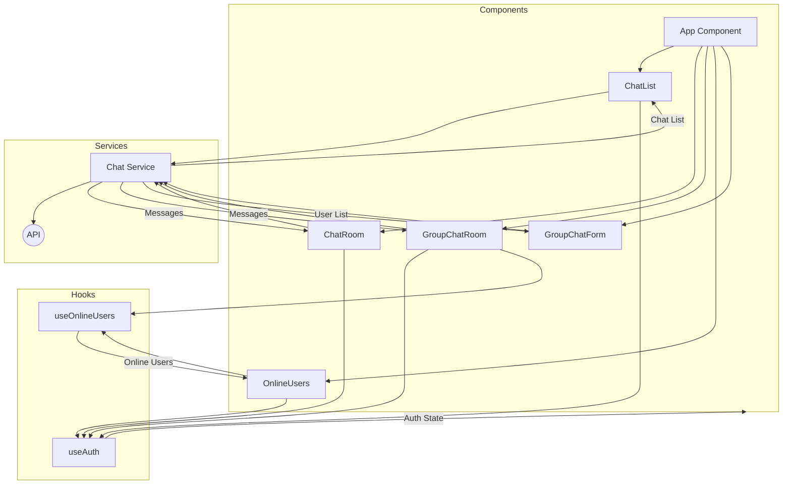

```mermaid
graph TB
    subgraph Components
        App[App Component] --> ChatList[ChatList]
        App --> ChatRoom[ChatRoom]
        App --> GroupChatRoom[GroupChatRoom]
        App --> OnlineUsers[OnlineUsers]
        App --> GroupChatForm[GroupChatForm]
    end

    subgraph Services
        chatService[Chat Service] --> API((API))
    end

    subgraph Hooks
        useAuth[useAuth]
        useOnlineUsers[useOnlineUsers]
    end

    %% Component Dependencies
    ChatList --> chatService
    ChatList --> useAuth
    ChatRoom --> chatService
    ChatRoom --> useAuth
    GroupChatRoom --> chatService
    GroupChatRoom --> useAuth
    GroupChatRoom --> useOnlineUsers
    OnlineUsers --> useOnlineUsers
    OnlineUsers --> useAuth
    GroupChatForm --> chatService

    %% Data Flow
    chatService -- Messages --> ChatRoom
    chatService -- Messages --> GroupChatRoom
    chatService -- Chat List --> ChatList
    chatService -- User List --> GroupChatForm
    useOnlineUsers -- Online Users --> OnlineUsers
    useAuth -- Auth State --> Components
```
