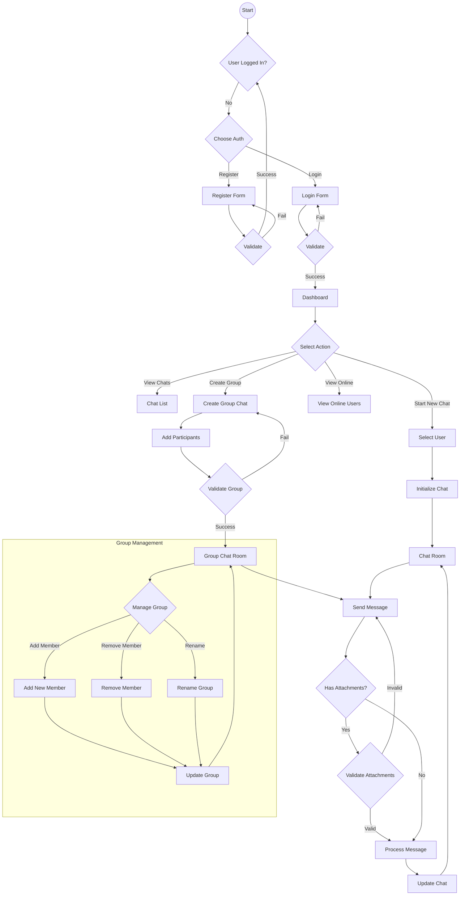

```mermaid
flowchart TB
    Start((Start)) --> Login{User Logged In?}
    Login -->|No| AuthChoice{Choose Auth}
    AuthChoice -->|Register| RegisterProcess[Register Form]
    AuthChoice -->|Login| LoginProcess[Login Form]
    RegisterProcess --> ValidateReg{Validate}
    ValidateReg -->|Success| Login
    ValidateReg -->|Fail| RegisterProcess
    LoginProcess --> ValidateLogin{Validate}
    ValidateLogin -->|Fail| LoginProcess

    ValidateLogin -->|Success| Dashboard[Dashboard]
    Dashboard --> ChatOptions{Select Action}

    ChatOptions -->|View Chats| ChatList[Chat List]
    ChatOptions -->|Start New Chat| SelectUser[Select User]
    ChatOptions -->|Create Group| CreateGroup[Create Group Chat]
    ChatOptions -->|View Online| ViewOnline[View Online Users]

    SelectUser --> InitChat[Initialize Chat]
    InitChat --> ChatRoom[Chat Room]

    CreateGroup --> AddParticipants[Add Participants]
    AddParticipants --> ValidateGroup{Validate Group}
    ValidateGroup -->|Success| GroupChat[Group Chat Room]
    ValidateGroup -->|Fail| CreateGroup

    ChatRoom --> SendMessage[Send Message]
    GroupChat --> SendMessage
    SendMessage --> HandleAttachments{Has Attachments?}

    HandleAttachments -->|Yes| ValidateAttach{Validate Attachments}
    ValidateAttach -->|Valid| ProcessMessage[Process Message]
    ValidateAttach -->|Invalid| SendMessage
    HandleAttachments -->|No| ProcessMessage

    ProcessMessage --> UpdateChat[Update Chat]
    UpdateChat --> ChatRoom

    subgraph "Group Management"
        GroupChat --> ManageGroup{Manage Group}
        ManageGroup -->|Add Member| AddMember[Add New Member]
        ManageGroup -->|Remove Member| RemoveMember[Remove Member]
        ManageGroup -->|Rename| RenameGroup[Rename Group]

        AddMember --> UpdateGroup[Update Group]
        RemoveMember --> UpdateGroup
        RenameGroup --> UpdateGroup
        UpdateGroup --> GroupChat
    end
```
