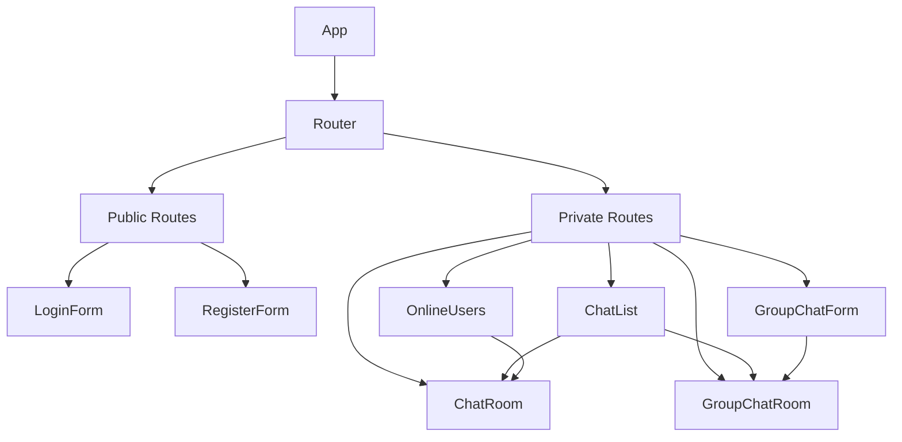
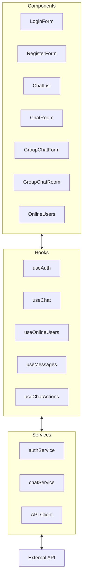
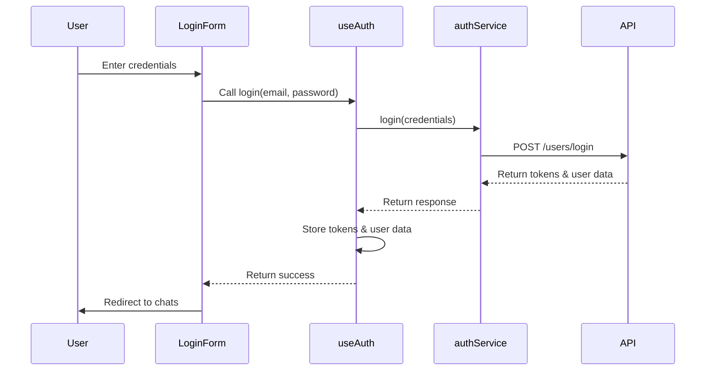
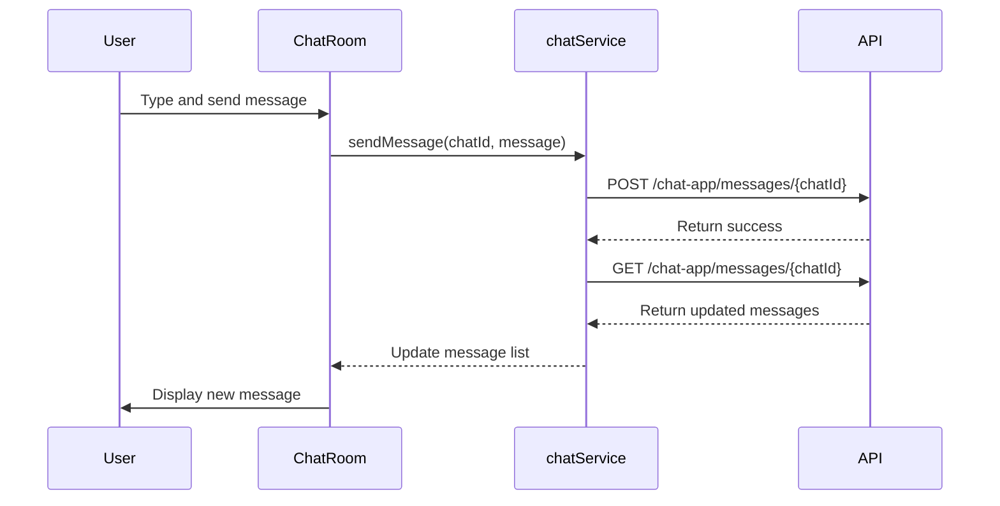
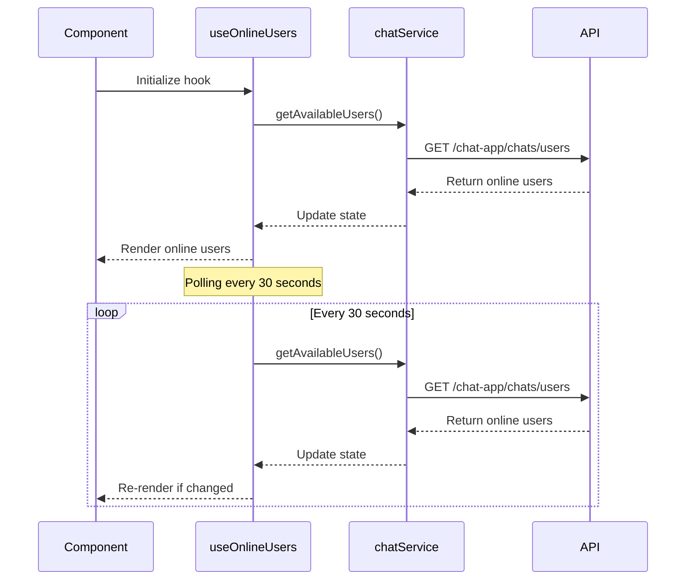
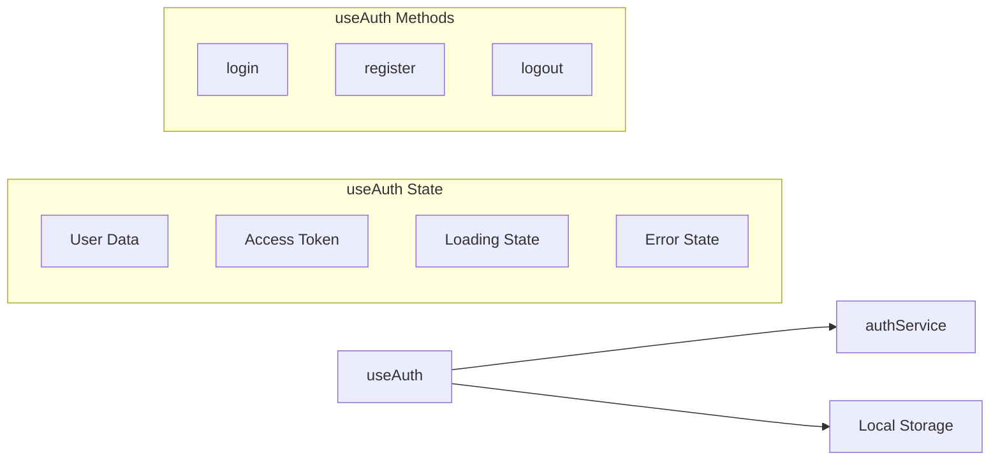
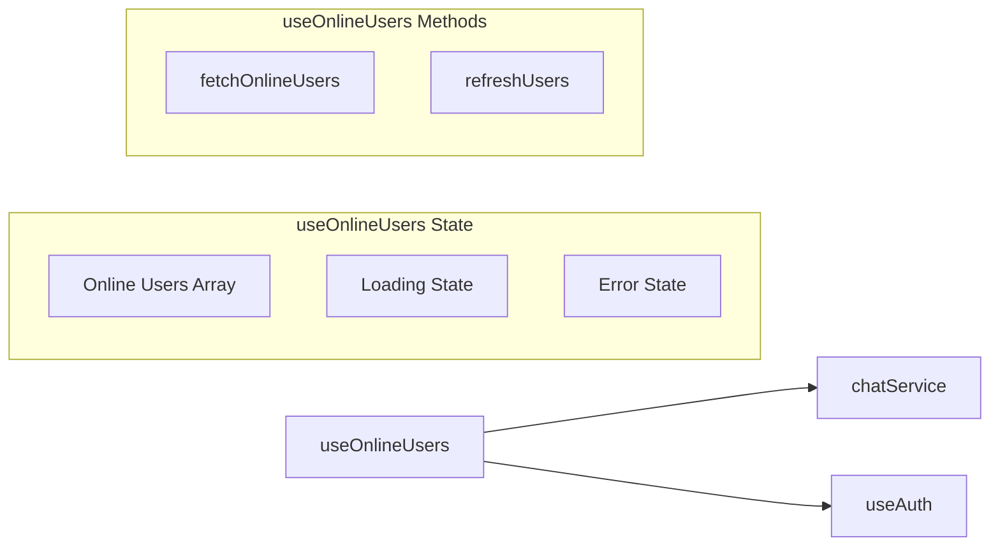
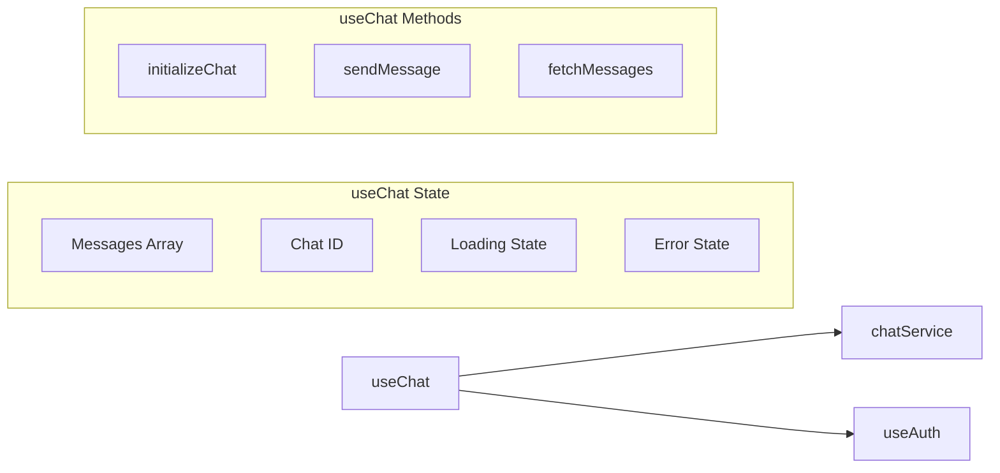

# Chat Application PRD (Product Requirements Document)

## Project Overview

This document outlines the comprehensive details of the Chat Application project, a real-time messaging platform that enables users to communicate through one-on-one and group conversations. The application provides a modern, responsive interface with features like user authentication, real-time messaging, online user status tracking, and group chat management.

## Technical Stack

### Frontend

- **Framework**: React (v19.0.0)
- **Routing**: React Router DOM (v7.4.0)
- **HTTP Client**: Axios
- **Styling**: Tailwind CSS
- **Build Tool**: Vite

### Backend

- **API**: External REST API (FreeAPI.app)
- **Authentication**: JWT-based (access token and refresh token)

## Core Features

### User Authentication

- User registration with email, username, and password
- User login with email and password
- JWT-based authentication with access and refresh tokens
- Automatic token refresh mechanism

### Messaging

- One-on-one chat conversations
- Group chat functionality
- Real-time message updates (polling-based)
- Message deletion
- File attachments support (up to 5 attachments per message)

### User Management

- View online users
- Search users by username
- User online status tracking

### Chat Management

- Create and manage group chats
- Add/remove participants to group chats
- Edit group chat names
- View all active chats (one-on-one and group)

## Application Architecture

### Component Structure

### Data Flow Architecture

## Data Flow Between Components

### Authentication Flow

### Messaging Flow

### Online Users Flow

## Key Components and Their Interactions

### Authentication Components

- **LoginForm**: Handles user login through the useAuth hook
- **RegisterForm**: Manages user registration through the useAuth hook

### Chat Components

- **ChatList**: Displays all active chats and navigates to individual chat rooms
- **ChatRoom**: Handles one-on-one messaging using chatService
- **GroupChatForm**: Creates new group chats with selected participants
- **GroupChatRoom**: Manages group chat messaging and participant administration
- **OnlineUsers**: Shows available users for starting new conversations

## Custom Hooks

### useAuth

Manages authentication state and provides login, register, and logout functions.

### useOnlineUsers

Fetches and maintains the list of online users with periodic updates.

### useChat

Provides chat initialization and message management for a specific chat.

## Services

### authService

Handles authentication API requests including login, registration, and token refresh.

### chatService

Manages all chat-related API requests:

- Creating one-on-one and group chats
- Sending and receiving messages
- Fetching online users
- Managing group chat participants

### API Client (api.js)

Configures Axios with interceptors for:

- Adding authentication tokens to requests
- Handling token refresh on 401 errors
- Managing API responses and errors

## Data Models

### User

- `_id`: Unique identifier
- `username`: User's display name
- `email`: User's email address
- `avatar`: Profile picture URL
- `isOnline`: Online status

### Chat

- `_id`: Unique identifier
- `participants`: Array of User objects
- `isGroupChat`: Boolean flag
- `name`: Group chat name (for group chats)
- `createdBy`: User who created the chat
- `lastMessage`: Most recent message

### Message

- `_id`: Unique identifier
- `chat`: Reference to Chat
- `sender`: Reference to User
- `content`: Message text
- `attachments`: Array of file URLs
- `createdAt`: Timestamp

## Future Enhancements

1. **Real-time Messaging**: Implement WebSockets for true real-time communication instead of polling
2. **Message Status**: Add read receipts and typing indicators
3. **Rich Media Support**: Enhance attachment handling with previews and better UX
4. **Push Notifications**: Add support for browser notifications
5. **Message Search**: Implement search functionality within conversations
6. **User Profiles**: Add detailed user profiles with status messages
7. **Message Reactions**: Allow emoji reactions to messages

## Technical Considerations

1. **Authentication**: The application uses JWT with access and refresh tokens stored in localStorage
2. **API Communication**: All API requests are made through the centralized API client
3. **State Management**: Custom hooks manage component state and API interactions
4. **Polling**: Messages and online users are updated through polling (future: WebSockets)
5. **Error Handling**: Consistent error handling pattern across services and components
